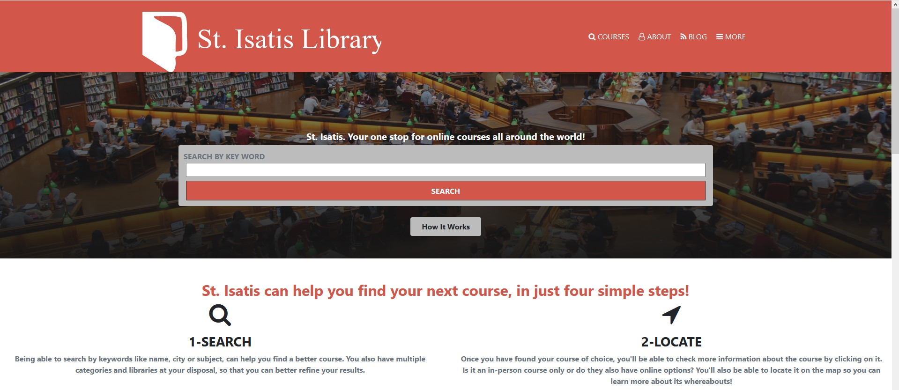

# St. Isatis, a directory of courses

This is a concept project for a virtual directory of courses with three pages:

- the main page (search page), with a link to the results page
- the search results page, with a list of schools each with a link to the detail school page
- the detail and sign-up school page

This project was done using the design idea by [Mathew Njuguna and others on Behance](https://www.behance.net/mathewnjuguna) as inspiration and as an outline on how to style the general elements in the page.

You can access all the design info (layouts) in this link:
[https://www.behance.net/gallery/25563385/PatashuleKE](https://www.behance.net/gallery/25563385/PatashuleKE)

## Built With

- HTML
- CSS
- Bootstrap

## Live Demo

[Live Demo Link]()

## Getting Started

- Run this command in your OS terminal: `git clone https://github.com/LoxiasCam/directoryCapstone.git` to get a copy of the project.
- To run the project open the `index.html` file in a web browser.

### Prerequisites

* Internet connection
* A browser that supports HTML5 and the latest version of CSS
* A text editor is not required, but is highly recommended so that you may better preview and edit the code. Popular choices include Atom or VSCode.

### Setup

* Clone the repository

### Usage

* Open index.html in your browser for a preview of the website.

### Deployment

To deploy a webpage, first push the project to a repository. Then, in the project settings there will be a section called github pages that will let you choose the branch that you want to deploy, after the branch is selected the project will be live on your-github-username.github.io/your-github-repo-name

## Authors

#### Camilo Patino
GitHub: [LoxiasCam](https://github.com/LoxiasCam)

## 🤝 Contributing

Contributions, issues, and feature requests are welcome!

Feel free to check the [issues page](https://github.com/LoxiasCam/directoryCapstone/issues).

## Show your support

Give a ⭐️ if you like this project!

## Acknowledgments and special thanks

- Again, to Matthew Njuguna and his team for the design!
- To [Pexels.com](https://www.pexels.com/es-es/) for their royalty free images.
- To [Method Draw](https://editor.method.ac/), an open source SVG editor that helped me create the SVG logo used in the header.
- To [FreeLogoDesign](https://www.freelogodesign.org/) for providing an useful tool to make the logo used in the search results page.
- To [Barret Sontag](https://codepen.io/sosuke) on Codepen for his [CSS Filter Generator](https://codepen.io/sosuke/pen/Pjoqqp), which was incredibly useful to create different CSS filters.

## 📝 License

This project is [MIT](https://es.wikipedia.org/wiki/Licencia_MIT) licensed.
